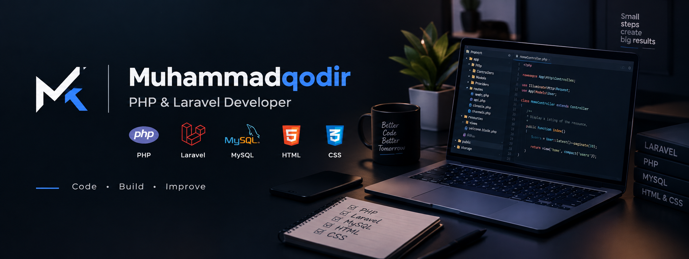

# 👋 Hi, I'm Muhammadqodir

### 💻 PHP & Laravel Developer

I'm a web developer focused on building practical and user-friendly web applications using PHP, Laravel, MySQL, HTML, and CSS.

I enjoy learning new technologies, developing real-world projects, and improving my backend and web development skills.

---

## 🚀 About Me

* 💻 PHP & Laravel Developer
* 🌐 Web Application Development
* 🗄️ MySQL Database
* 🎨 HTML & CSS
* 🔧 Git & GitHub
* 📚 Continuously learning and improving my development skills

---

## 🛠️ Technologies & Tools

### Backend

### Frontend

### Database

### Tools

---

## 📌 Featured Projects

### 🌐 Web Applications

Developing web applications using PHP, Laravel, MySQL, HTML, and CSS.

### 🔐 Authentication Systems

User registration, login, authentication, authorization, and user management.

### 🗄️ Database Applications

Working with MySQL databases, migrations, relationships, CRUD operations, and data management.

## 📫 Connect With Me

* 💻 GitHub: [Muhammadqodir-wmp](https://github.com/Muhammadqodir-wmp)
* 💼 LinkedIn: Add your LinkedIn
* 📱 Telegram: t.me/muhammadqodir_bi
* 📧 Email: muhammadqodirabduhalilov21@gmail.com

---

### 🚀 Code • Learn • Build • Improve

Thanks for visiting my profile! ⭐

  

